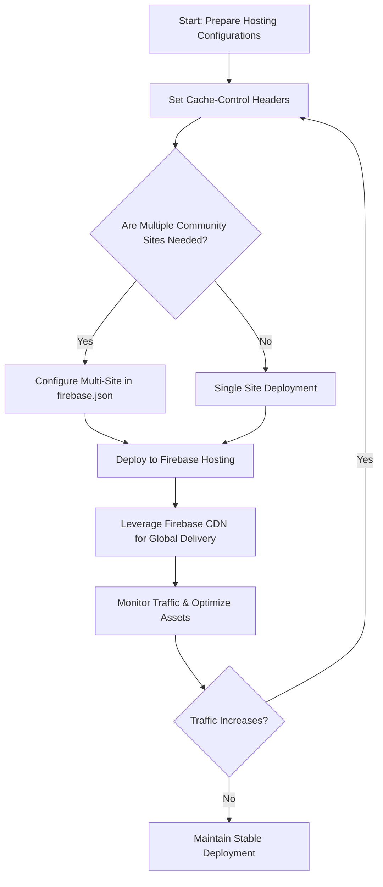

# Scaling Your Deployment

Harnessing Firebase Hosting's robust infrastructure allows Aura deployments to effortlessly support growing audiences and multiple community sites. This guide walks you through leveraging Firebase Hosting's built-in content delivery network (CDN), advanced caching techniques, and multi-site management to ensure your Aura deployment scales seamlessly under increased traffic loads.

---

## 1. Understanding Firebase Hosting's CDN and Caching

Firebase Hosting automatically distributes your static and dynamic assets through its global CDN network. This reduces latency by serving content from edge locations near your users, giving your Aura deployment a solid foundation for scaling.

### Key Benefits:
- **Global Edge Caching:** Content is cached close to user locations worldwide.
- **Intelligent Cache Invalidation:** Firebase efficiently updates stale content.
- **Automatic HTTP/2 Support:** Enables multiplexing and faster transport.

### User Scenario:
Imagine a rapid growth in your community’s user base across multiple regions. Firebase’s CDN ensures your site loads swiftly for everyone without requiring manual caching setup.

---

## 2. Advanced Caching Strategies

Beyond Firebase's default caching, tuning cache behavior can significantly optimize bandwidth usage and responsiveness.

### Step-by-Step: Configure Cache Control Headers

1. **Review Firebase Hosting `firebase.json` configuration:**
   Firebase allows customizing cache policies per hosting target or URL.

2. **Set Appropriate Cache Durations:**
   - For frequently updated content (e.g., dynamic site sections), use shorter cache durations (e.g., `max-age=60`).
   - For static assets (images, CSS, JS), set longer cache lifetimes (e.g., `max-age=31536000`).

3. **Implement Immutable Caching for Versioned Assets:**
   Name static files with hashes (e.g., `app.123abc.js`) and set `immutable` directive to prevent unnecessary revalidation.

4. **Leverage Firebase's Cache-Control Options:**
   Example snippet in `firebase.json`:

```json
{
  "hosting": {
    "public": "public",
    "headers": [
      {
        "source": "/static/**",
        "headers": [
          {"key": "Cache-Control", "value": "public, max-age=31536000, immutable"}
        ]
      },
      {
        "source": "/index.html",
        "headers": [
          {"key": "Cache-Control", "value": "no-cache"}
        ]
      }
    ]
  }
}
```

### Tips:
- Use `no-cache` or `no-store` wisely to ensure critical dynamic content stays fresh.
- Test cache behavior after deployment with browser DevTools and curl commands.

---

## 3. Multi-Site Deployment with Firebase Hosting

Aura supports expanding into multiple community sites by leveraging Firebase Hosting's multi-site feature. This enables you to manage separate sites (e.g., different communities or regional portals) within the same Firebase project.

### How to Set Up Multi-Site:

1. **Create Additional Hosting Sites in Firebase Console:**
   Navigate to your Firebase project > Hosting > Add New Site.

2. **Configure Each Site's Deployment Target:**
   Modify your `firebase.json` to define hosting targets:

```json
{
  "hosting": [
    {
      "target": "communityA",
      "public": "public/communityA",
      "ignore": ["firebase.json", "**/.*", "**/node_modules/**"]
    },
    {
      "target": "communityB",
      "public": "public/communityB",
      "ignore": ["firebase.json", "**/.*", "**/node_modules/**"]
    }
  ]
}
```

3. **Deploy to Specific Sites:**

Use Firebase CLI to deploy:

```bash
firebase deploy --only hosting:communityA
firebase deploy --only hosting:communityB
```

4. **Map Custom Domains or Subdomains:**
   Assign custom URLs for each site using Firebase Console's domain management to ensure distinct branding and identity.

### Real-World Use Case:
When launching a new region-specific community portal under your Aura deployment, multi-site hosting isolates content and resources while benefiting from centralized management.

---

## 4. Load Management and Traffic Optimization

Firebase Hosting’s infrastructure inherently manages scaling by handling heavy traffic bursts gracefully. However, consider these best practices:

### Best Practices:

- **Use HTTP/2 and Brotli Compression:** Enabled by default, they significantly reduce payload sizes and improve resource loading times.
- **Optimize Asset Sizes:** Compress images and minify CSS/JS.
- **Implement Lazy Loading in Your App:** Load content as needed to reduce initial load times.
- **Monitor Traffic Patterns:** Use Firebase Analytics and monitoring tools to identify peak load times and optimize content delivery accordingly.

### Troubleshooting Pitfalls:

- **Cache Invalidation Delays:** Updating assets may take a few minutes to propagate through the CDN. Use versioned assets to mitigate.
- **Unexpected 404 Errors on Multi-sites:** Ensure each site’s public folder contains the appropriate files with correct routing.

Refer to the [Troubleshooting Deployment & Common Issues guide](/deployment/operations-monitoring-maintenance/troubleshooting-deployment) for step-by-step debugging of common problems.

---

## 5. Summary Diagram: Scaling Deployment Workflow



---

## 6. Next Steps and Resources

- After scaling your deployment, explore [Security Hardening](/deployment/advanced-deployment-hardening/security-best-practices) to protect your growing community.
- Setup continuous monitoring with the [Monitoring and Logging guide](/deployment/operations-monitoring-maintenance/monitoring-logging).
- Learn to build and deploy efficiently with [Building the Application](/deployment/prod-deployment-workflow/build-process) and [Firebase Hosting & Deployment](/deployment/prod-deployment-workflow/firebase-hosting-deploy).

<Tip>
Scaling is not just about handling more users, but also about preparing your Aura deployment to deliver fast, reliable, and tailored experiences across your communities. Use Firebase Hosting's powerful features strategically to future-proof your deployment.
</Tip>

<Note>
Always test cache and multi-site configurations in staging environments before pushing to production. This minimizes downtime and exposes potential issues early.
</Note>

<Check>
Remember to validate each deployed site independently, ensuring custom domains resolve correctly and content updates propagate as expected.
</Check>
