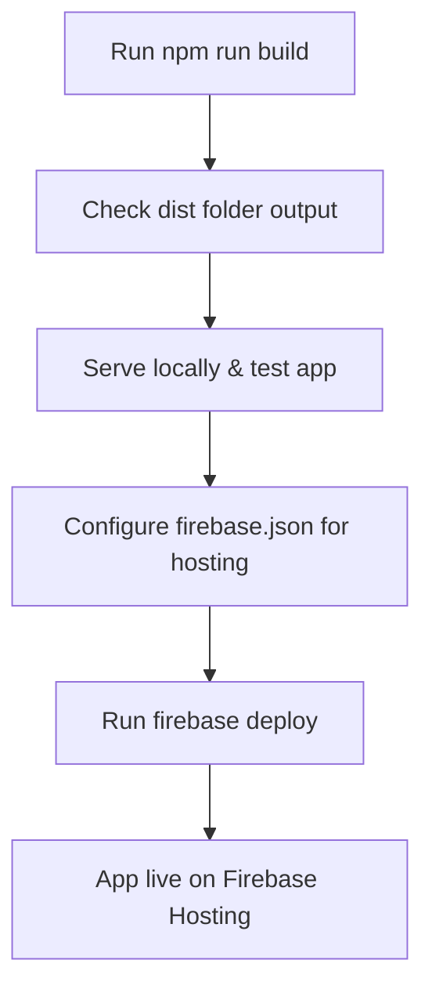

# Building for Production

Transform your Aura web application into a production-ready package of static assets optimized for deployment. This guide walks you through the essential steps to build Aura, verify the output, and prepare for seamless deployment on Firebase Hosting.

---

## Why Build for Production?

Building for production converts your development code into efficient, minified, and cached static files ideal for fast delivery. It ensures your app loads quickly, works offline, and delivers an optimal experience to end users.


## Prerequisites

Before proceeding, ensure:

- Your local environment has all dependencies installed (`npm install`).
- Firebase CLI is installed and configured if you plan to deploy immediately.
- Your environment variables and Firebase configuration are properly set ([see Environment Configuration](../deployment-essentials/environment-configuration)).


## Step 1: Run the Production Build Command

Open your terminal in the Aura project root directory and run:

```bash
npm run build
```

This command triggers Vue CLI to:

- Transpile and bundle your source code.
- Optimize and minify JavaScript and CSS files.
- Generate static assets in the `dist` directory.
- Inject service worker files for PWA offline support.


### What to Expect

- A `dist` folder appears in your project root.
- The folder contains your complete production site:
  - `index.html` — Single page entry point.
  - JavaScript and CSS bundles.
  - Static assets (images, fonts).
  - `service-worker.js` for caching and offline capabilities.


## Step 2: Verify the Build Output Structure

Ensure the `dist` folder contains:

- `index.html` at the root, acting as the main entry.
- Optimized CSS and JS files, with hashes appended for cache-busting.
- PWA manifest and service worker files configured according to `vue.config.js`.


## Step 3: Perform Basic Validation Checks

Before deployment, verify:

- Open `dist/index.html` locally in a browser (via a local HTTP server, e.g. `serve -s dist`) to confirm the app loads.
- Check console for JavaScript errors or missing assets.
- Confirm offline support by disconnecting the internet and reloading — the app should display cached content.


## Step 4: Understanding Service Worker Integration

Aura uses a service worker configured via Workbox (`vue.config.js`) with an "InjectManifest" mode. This setup optimizes caching strategies for:

- Fast content loading.
- Automatic update prompts for new app versions.

Service worker registration is handled in `src/registerServiceWorker.js`, which listens for updates and notifies users to refresh.


## Step 5: Preparing for Firebase Hosting Deployment

The `dist` folder is your deployment-ready bundle. Ensure your `firebase.json` is configured correctly:

```json
{
  "hosting": {
    "site": "Your_Site_ID",
    "public": "dist",
    "rewrites": [
      {
        "source": "**",
        "destination": "/index.html"
      }
    ],
    "ignore": ["firebase.json", "**/.*", "**/node_modules/**"]
  }
}
```

Replace `Your_Site_ID` with your actual Firebase Hosting site ID.


## Step 6: Next Steps — Deploy the Build

Deploy the build using the Firebase CLI:

```bash
firebase deploy
```

This publishes the contents of `dist` to your Firebase Hosting site, making your Aura app live.


---

## Practical Tips and Best Practices

- **Clean your build folder before running build again**: This avoids stale files.
- **Disable source maps in production** (already set in `vue.config.js`) to protect source code.
- **Test your app on multiple devices** and browsers after build.
- **Monitor console logs** for unexpected warnings.


## Common Pitfalls and Troubleshooting

<AccordionGroup title="Troubleshooting Production Builds">
<Accordion title="Build Fails or Errors Out">
- Verify Node.js and npm versions are compatible.
- Run `npm install` again to ensure dependencies are intact.
- Check for syntax or import errors in code.
</Accordion>

<Accordion title="App Loads Blank After Deployment">
- Confirm Firebase Hosting `public` folder points to `dist`.
- Ensure rewrites are configured for single-page app (all URLs redirect to `index.html`).
- Validate service worker registration isn’t blocking fresh content.
</Accordion>

<Accordion title="Offline Mode Not Working">
- Check service worker logs in browser console.
- Confirm service worker is registered successfully (`console.log` statements in `registerServiceWorker.js`).
- Clear browser cache and reload.
</Accordion>
</AccordionGroup>


## Summary Flow




## References and Related Documentation

- [Environment Configuration](../deployment-essentials/environment-configuration) — preparing your environment for production
- [Deploying to Firebase Hosting](../deployment-essentials/firebase-hosting-deployment) — detailed deployment steps
- [Troubleshooting Common Issues](../../getting-started/troubleshooting-validation/common-issues) — identify and resolve issues during builds
- [Optimizing PWA and Offline Support](../../guides/advanced-customization-and-optimization/optimizing-pwa-and-offline-support) — enhance offline reliability


---

Building Aura for production ensures your users get a fast, reliable, and polished web app experience that scales effortlessly. With this guide, you hold the keys to confidently generate and verify your production artifacts — a critical step before deploying to Firebase Hosting and sharing your community’s digital presence with the world.


