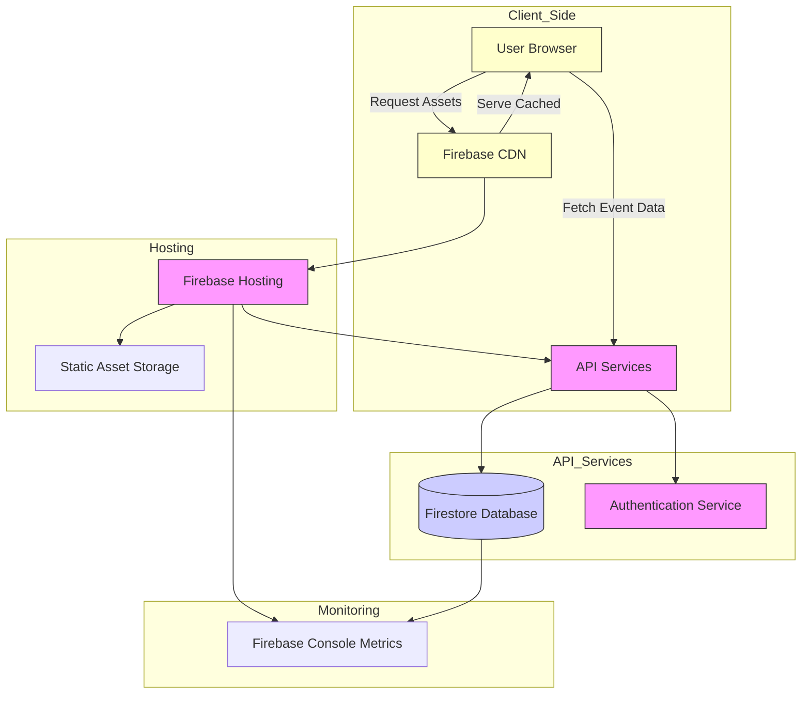

# Scaling and Performance Optimization

As your community grows, ensuring Aura scales efficiently and performs optimally is critical. This guide empowers you with proven strategies to handle increased traffic, large event spikes, and smooth user experiences — all while maintaining the reliable, fast performance Aura is known for.

---

## 1. Understanding Firebase Hosting Scalability

Aura is hosted on Firebase Hosting, a fully managed, high-performance platform designed to automatically scale as your user base grows. Firebase handles server provisioning and traffic balancing behind the scenes, so you don't have to worry about infrastructure limits when facing increased demand.

### Key Firebase Hosting Attributes for Scaling
- **Global CDN Delivery:** Static assets and pages are cached globally, minimizing latency for end-users anywhere in the world.
- **Automatic Load Balancing:** Traffic spikes are absorbed seamlessly through Google’s infrastructure, ensuring uptime during peak event registrations or major announcements.
- **Serverless Architecture:** No server management burden means reliable, consistent performance regardless of traffic volume.

### What This Means for You
You can focus on growing your community and managing content without manual scaling. Firebase Hosting scales elastically, making Aura capable of supporting large tech communities with minimal operational overhead.

---

## 2. Optimizing Aura for Faster Load Times

Even with robust hosting, optimizing your Aura deployment ensures the fastest possible user experience. Here's how to tune Aura for speed:

### A. Leverage Production Builds
- Always deploy using the optimized production build (`npm run build`) to generate minified, tree-shaken, and cache-friendly assets.
- Confirm your build output verifies as expected (see [Production Build Guide](/getting-started/configuration-run/production-build)) before deployment.

### B. Use Lazy Loading
- Aura components like speaker profiles, event cards, and partner logos load data asynchronously, improving initial page load times.
- This strategy ensures users see critical content quickly while less urgent data loads in the background.

### C. Cache Efficiently
- Firebase Hosting automatically caches static assets in CDN. Use caching headers configured in `firebase.json` to maximize cache hits.
- The default service worker provided with Aura pre-caches core assets for offline use, reducing network requests on repeat visits.

### D. Optimize Images and Media
- Use Aura’s built-in fallback images (`noimage.jpg`, placeholders) and lazy loading for images to reduce bandwidth.
- Minimize image sizes and use modern formats where possible to enhance page responsiveness.

### E. Monitor Load Metrics
Leverage Firebase Console analytics and browser developer tools for real-world performance data, identifying bottlenecks and opportunities.

---

## 3. Handling Large Event Spikes and High Traffic Patterns

Certain occasions — like announcing a major event or a keynote speaker — can generate traffic surges. To prepare Aura for such spikes:

### A. Pre-warm the CDN
- Before large events, trigger cache warm-up by visiting key pages from multiple locations.
- This ensures the CDN nodes hold the latest content, reducing first-user latency.

### B. Throttle API Calls in Components
- Aura fetches event, speakers, and partner data via service calls. Throttling or debouncing requests in client-side code prevents overwhelming remote APIs.
- The architecture already supports graceful loading and error handling for API issues.

### C. Use Data Pagination and Limits
- Components like past events tables restrict items per page and use search queries to limit data volume per request.
- Avoid loading excessive data client-side to keep UI smooth and responsive.

### D. Fail Gracefully and Provide Feedback
- If data fetching slows or fails, Aura shows clear messages and fallback UIs so users understand the state instead of experiencing silent failures.

### E. Plan Maintenance Windows
- For sustained traffic, schedule maintenance windows during low usage times.
- Coordinate content updates or configuration changes outside peak hours to minimize disruption.

---

## 4. Performance Tuning Best Practices

To maximize Aura’s efficiency and reliability, implement these best practices:

- **Keep Dependencies Updated:** Ensure libraries like Vuetify and Vuex are current for performance improvements and bug fixes.
- **Minimize Custom Heavy Scripts:** Avoid adding bulky custom scripts or widgets that can slow down load times.
- **Use Environment Specific Configurations:** Tailor logging and debugging settings to production vs. development environments to reduce overhead.
- **Audit Third-Party Integrations:** Regularly review APIs like Meetup integration to guarantee efficient data retrieval.
- **Enable Compression:** Firebase Hosting supports gzip and Brotli compression for assets — confirm your configs enable these.

---

## 5. Monitoring and Troubleshooting Performance

Monitoring Aura’s operational health is vital to maintain peak performance:

- **Firebase Console:** Use the Hosting, Firestore, and Cloud Functions dashboards to view traffic rates, error rates, and latency.
- **Service Worker Logs:** Inspect browser console logs for service worker registration and caching issues.
- **User Feedback:** Monitor error snacking in UI components that inform visitors of loading issues.

<Tip>
Establish alerting based on traffic anomalies or error spikes using Firebase Extensions or third-party monitoring tools to proactively react to performance degradations.
</Tip>

---

## 6. Continuous Scaling & Capacity Planning

As your community evolves, periodically reassess your setup:

- Review event sizes and traffic trends quarterly.
- Adjust Firebase project settings and billing plans to support higher throughput.
- Optimize content structure — for example, archive outdated events externally to reduce dataset size.

By maintaining a rhythm of evaluation and optimization, Aura will continue delivering a seamless experience to your growing audience.

---

## Summary
Scaling Aura centers on fully leveraging Firebase Hosting’s elasticity and tuning your application for efficient load handling. Combining production-optimized builds, lazy loading, smart caching, and proactive traffic spike preparation ensures your Aura deployment remains fast and reliable even as your community scales. Keep monitoring actively and adjust as you grow to maintain exceptional performance.

---

For comprehensive deployment and optimization workflows, consult the following guides:

- [Building & Deploying for Production](/getting-started/configuration-run/production-build)
- [Deploying to Firebase Hosting](/deployment/deployment-essentials/firebase-hosting-deployment)
- [Monitoring and Logging](/deployment/operations-and-maintenance/monitoring-and-logging)
- [Troubleshooting Common Issues](/getting-started/troubleshooting-validation/common-issues)
- [Optimizing PWA and Offline Experience](/guides/advanced-customization-and-optimization/optimizing-pwa-and-offline-support)

Also, consider related guides on:

- [Showcasing Team and Speakers](/guides/managing-content-events-team/showcasing-team-and-speakers)
- [Publishing and Managing Events](/guides/managing-content-events-team/publishing-and-managing-events)
- [Branding and Theme Advanced](/guides/advanced-customization-and-optimization/branding-and-theme-advanced)

---

Maintaining high performance and scalability is a continuous journey. With careful preparation and awareness of Aura's capabilities, your community microsite will provide an outstanding user experience at every growth stage.

---

<Info>
If you encounter performance slowdowns or issues under load, first verify your Firebase project quota and optimize your app builds as outlined above before escalating to Firebase support.
</Info>

---

# Diagram Overview: Aura Scaling and Performance Flow

This flowchart illustrates the interaction between users, Firebase Hosting, CDN caching, API services accessing Firestore, and monitoring dashboards supporting scalable performance.

---