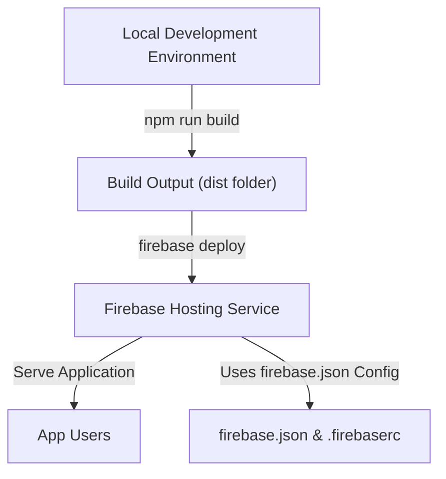

# Deploying Aura on Firebase Hosting

Deploying Aura on Firebase Hosting enables you to deliver a fast, secure, and scalable Progressive Web App experience tailored for managing tech communities. This guide walks you through each critical step, from preparing your environment to deploying the app seamlessly using Firebase CLI. By following these instructions, you'll bring Aura live with proper routing and configuration for optimal user experience.

---

## Prerequisites for Firebase Deployment

Before starting the deployment process, ensure you meet these requirements:

- **Firebase Project**: Have an active Firebase project configured in the Firebase Console. This should be the same project used by Aura Admin to ensure seamless data integration.
- **Built Aura App**: Produce a production-ready build of Aura using `npm run build`. The build output will be in the `dist` directory.
- **Firebase CLI Installed**: Install Firebase CLI globally with:

  ```bash
  npm install -g firebase-tools
  ```

- **Firebase CLI Logged In**: Log in to your Firebase account on the CLI by running:

  ```bash
  firebase login
  ```

- **Correct Project and Site IDs**: Know your Firebase Project ID and the Hosting Site ID from the Firebase console.

- **Access to Terminal**: Use a terminal or command-line interface positioned at your Aura project root directory.


---

## Step 1: Confirm Your Firebase Project and Site ID

1. Log into [Firebase Console](https://console.firebase.google.com).
2. Select the Firebase project linked to Aura.
3. Navigate to the **Hosting** section in the left-side menu.
4. Click on **Get Started** if you haven’t set up hosting yet.
5. Note the hosting domain provided (e.g., `myaurapp.web.app`).
6. Extract the **Site ID**: This is the subdomain part before `.web.app` or `.firebaseapp.com` (e.g., `myaurapp`). This value is required in your `firebase.json`.

---

## Step 2: Configure `firebase.json` for Hosting

The `firebase.json` file in the root of your project directs Firebase Hosting how to serve your deployed content. Configure it carefully to correctly map your Vue.js app.

Example `firebase.json` file configuration:

```json
{
  "hosting": {
    "site": "Your_Firebase_Hosting_id",
    "public": "dist",
    "rewrites": [{
      "source": "**",
      "destination": "/index.html"
    }],
    "ignore": [
      "firebase.json",
      "**/.*",
      "**/node_modules/**"
    ]
  }
}
```

### Explanation:
- **site**: Replace with your actual Firebase Hosting Site ID.
- **public**: Points to the production build folder, `dist`, which contains your compiled Aura app.
- **rewrites**: Routes all requests to `index.html` to enable Vue Router’s history mode to function properly with client-side routing.
- **ignore**: Files not to upload during deployment.

<Note>
Setting the correct `site` is crucial. Using the wrong site ID will either fail deployment or deploy to an unintended domain.
</Note>

---

## Step 3: Build the Aura Application for Production

Inside your project root, run the Vue CLI build command to generate optimized production files:

```bash
npm run build
```

This command creates the `dist` folder with your compiled SPA assets, ready for deployment.

<Tip>
Before deploying, verify the build locally by serving the `dist` folder using a static server to check for any build or routing issues.
</Tip>

---

## Step 4: Deploy to Firebase Hosting

With your environment ready and configuration set, execute the deployment:

```bash
firebase deploy
```

### What happens during deployment?
- The CLI uploads your `/dist` folder contents to Firebase Hosting.
- Firebase applies your `firebase.json` configurations.
- Once completed, you will receive a hosted URL (e.g., `https://myaurapp.web.app`) where Aura is live.

<Check>
Ensure you run this command from the root of your Aura project where `firebase.json` is located.
</Check>

---

## Step 5: Verify the Deployment

- Open the provided deployment URL.
- The Aura app should load correctly with all routes working.
- Verify client-side routing is functioning (navigate to `/team`, `/events`, `/speakers`, etc.).
- Confirm offline support and service worker functionality as applicable.

<Warning>
If navigation results in 404 errors, verify that your rewrites config is correct in `firebase.json` and that your Vue Router mode is set to `history`.
</Warning>

---

## Key Configuration Files in Deployment

### `firebase.json`
Handles hosting site, deployment directories, and URL rewrites.

### `.firebaserc`
Contains the Firebase project alias and project ID mapping. Make sure this matches your Firebase project precisely.

### Build Output Directory (`dist`)
Houses compiled SPA assets (HTML, JS, CSS).

<Info>
Together, these files guide Firebase Hosting to serve your Aura app correctly and handle deep URLs gracefully.
</Info>

---

## Common Pitfalls and Troubleshooting

<AccordionGroup title="Troubleshooting Common Firebase Deployment Issues">
<Accordion title="Issue: Firebase deploy command fails with 'Permission Denied'">
Ensure you are logged in with the correct Firebase account with permissions on the project:

```bash
firebase login
```

Double-check your project ID in `.firebaserc` or that you specify the project explicitly on deploy:

```bash
firebase deploy --project your-project-id
```
</Accordion>

<Accordion title="Issue: Refreshing non-root routes results in 404 on live site">
This indicates client-side routing is not properly handled. Confirm `firebase.json` contains the rewrite rule:

```json
"rewrites": [{ "source": "**", "destination": "/index.html" }]
```

This rewrite makes sure every route returns `index.html` where Vue Router takes over.
</Accordion>

<Accordion title="Issue: Deployed app does not load or shows blank screen">
- Confirm the `dist` folder has the build output.
- Check console errors for missing files.
- Verify all environment variables and Firebase SDK configurations are correctly set.
- Ensure your `firebase.json` points to the correct `public` folder.
</Accordion>

<Accordion title="Issue: Service Worker caching issues after deployment">
Clear your browser cache or unregister service workers. The updated build should trigger service worker updates via the registered SW logic.
</Accordion>
</AccordionGroup>

---

## Next Steps and Resources

- Validate your deployment with functional testing across routes and features.
- Set up continuous integration for automated builds and deploys.
- Consult the related guides on:
  - [Building for Production](https://docs.example.com/getting-started/deployment-quickstart/production-build)
  - [Service Worker, Offline Mode & App Updates](https://docs.example.com/deployment/operations-monitoring-maintenance/service-worker-pwa-updates)
  - [Troubleshooting Deployment & Common Issues](https://docs.example.com/deployment/operations-monitoring-maintenance/troubleshooting-deployment)

---

By following this deployment guide, you ensure that Aura delivers its powerful community management features reliably and professionally on Firebase Hosting, maximizing your reach and engagement.


---

## Quick Reference: Command Summary

| Command                 | Purpose                          |
|-------------------------|---------------------------------|
| `npm run build`         | Build production assets in `dist`|
| `npm install -g firebase-tools` | Install Firebase CLI globally  |
| `firebase login`        | Authenticate Firebase CLI       |
| `firebase deploy`       | Deploy app to Firebase Hosting  |

## Useful Links
- [Firebase Hosting Documentation](https://firebase.google.com/docs/hosting)
- [Firebase CLI Reference](https://firebase.google.com/docs/cli)
- [Vue Router History Mode Guide](https://router.vuejs.org/guide/essentials/history-mode.html)

---

## Diagram: Simplified Deployment Flow


---

## Final Notes
Remember, deploying Aura onto Firebase Hosting is the gateway to providing users with a polished, offline-capable, and fast community management experience. Ensuring your configuration files are precise and the project IDs match exactly is pivotal to a successful deployment. Once live, your Aura app is ready to empower tech communities worldwide.