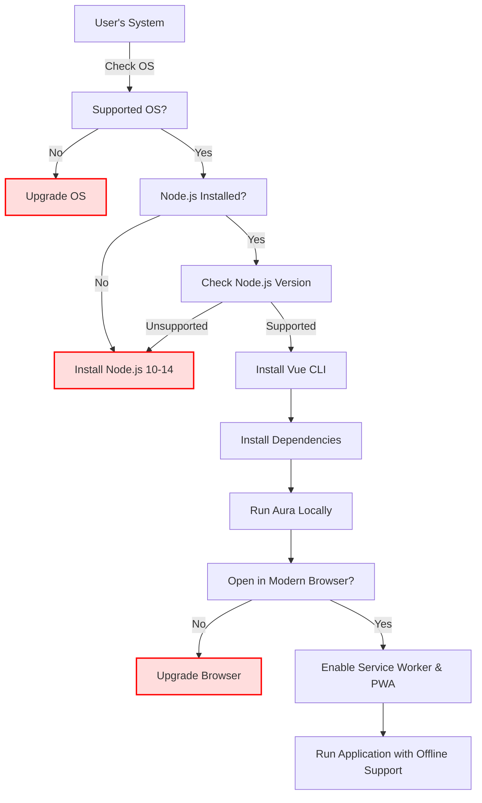

# System Requirements for Aura

This page outlines the supported operating systems, recommended Node.js versions, and browser compatibility requirements for running Aura effectively. Whether you're preparing to run Aura locally for development or installing it as a Progressive Web App (PWA), these system requirements will ensure a smooth and reliable experience.

---

## 1. Supported Operating Systems

Aura is built with Vue.js and optimized for both modern desktop and mobile environments. It supports the following platforms:

- **Windows 10 and later**
- **macOS 10.13 (High Sierra) and later**
- **Linux distributions with modern browser support (e.g., Ubuntu 18.04+, Fedora 30+)**
- **Mobile devices:**
  - Android 7.0 and above
  - iOS 12 and above

> Aura’s PWA capabilities allow it to be installed and run natively on supported mobile devices, providing an app-like experience.

## 2. Recommended Node.js Version (For Local Development)

Running Aura locally for development or building it for production requires Node.js. To ensure full compatibility and stability, use the following versions:

- **Node.js:** Version 10.x to 14.x (preferably the latest LTS within this range)
  - Versions outside this range might cause dependency or build issues.

- **Vue CLI:** Installed globally via npm
  ```bash
  npm install -g @vue/cli
  ```

> Check your Node.js version using:
  ```bash
  node -v
  ```


## 3. Browser Compatibility

Aura targets modern browsers that fully support ES6+, Service Workers, and PWA features:

| Browser | Minimum Supported Version | Notes                          |
|---------|---------------------------|--------------------------------|
| Google Chrome | 70+                      | Full PWA and offline support   |
| Mozilla Firefox | 65+                     | Supports offline caching       |
| Microsoft Edge | 79+ (Chromium-based)       | Supports all features          |
| Safari (Desktop) | 12.1+                  | Limited PWA support; service workers supported |
| Safari (iOS) | 12.2+                      | PWA installable, but some caching quirks |

> Older browsers or Internet Explorer are not supported and may result in degraded experience or application failure.

## 4. Network and Permissions Requirements

- **Internet Access:** Required initially to load the app and fetch configurations from Firebase. Offline mode supported via caching after first load.
- **Service Worker Support:** Must be enabled in the browser to leverage offline capabilities and push notifications.
- **Firebase Connectivity:** Ensure network allows connections to Firebase services (firestore, auth, storage, messaging) through standard HTTPS ports (443).

## 5. Practical Tips for Setup

- Use a **modern, updated browser** for both development and deployment to avoid compatibility problems.
- When developing locally, verify your Node.js version is within the supported range.
- On mobile devices, add Aura to your home screen for the best native app experience.
- For PWA installations, confirm the device and browser support service workers and offline caching.

## 6. Common Pitfalls and Troubleshooting

- **Issue:** App fails to load or shows connectivity errors.
  - **Check:** Network connectivity, firewall settings blocking Firebase endpoints.
  - **Remedy:** Ensure internet access, and that HTTPS ports are open.

- **Issue:** Older Node.js versions produce build errors.
  - **Check:** Run `node -v` to verify version.
  - **Remedy:** Upgrade Node.js to a supported LTS version.

- **Issue:** PWA features like offline mode do not work.
  - **Check:** Confirm browser supports service workers by visiting [https://caniuse.com/serviceworkers](https://caniuse.com/serviceworkers).
  - **Remedy:** Use a supported browser and clear cache or re-install the PWA.

---

## Additional Resources

- [Getting Started: Prerequisites](https://your-docs-url/getting-started/preparation/prerequisites) — Detailed setup of required tools and accounts.
- [Running Aura Locally](https://your-docs-url/getting-started/configuration-run/local-run) — Guide to start development server and validate environment.
- [PWA & Offline Support](https://your-docs-url/guides/advanced-customization-and-optimization/optimizing-pwa-and-offline-support) — Best practices to optimize offline user experience.

---

## Summary Diagram of System Readiness


This flowchart helps you verify your system readiness for running Aura smoothly.

---

You are now equipped to select and prepare your environment for a reliable Aura experience—whether for local development or production deployment.

For any issues not covered here, consult the [Troubleshooting Common Issues](https://your-docs-url/getting-started/troubleshooting-validation/common-issues) guide.
