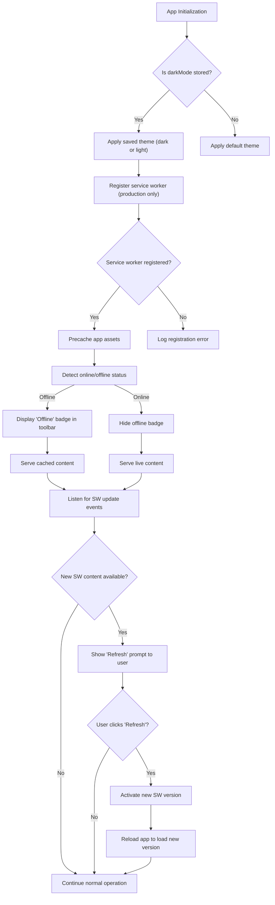

# Theme Switching & Offline Operation (PWA) Guide

## Overview
Aura delivers a seamless and modern user experience by offering dynamic theme switching between light and dark modes, as well as robust offline support through Progressive Web App (PWA) features powered by Workbox and Service Workers. This guide walks you through how these capabilities work, how you can customize the look and feel of your Aura community site, and how to ensure users enjoy full functionality even without an internet connection.

By mastering this page, you'll enable your community members to interact with your site effortlessly in any lighting condition and stay productive offline, enhancing engagement and retention.

---

## 1. Understanding Aura's Theme Switching

Aura employs Vuetify’s theming system to toggle between light and dark modes, which adjusts interface colors for improved readability and aesthetic preference.

### Key Features
- **Manual Toggle:** Users can switch themes anytime via the toolbar button.
- **Persistent Preference:** The chosen theme is saved in the user’s browser local storage, ensuring consistency across visits.
- **Meta Theme Color Update:** The browser's toolbar color dynamically updates to match the active theme, improving visual cohesion on mobile devices.

### How It Works
- On app startup, Aura reads the `darkMode` preference from local storage and applies it.
- The toolbar contains a button with a brightness icon indicating current mode (sun for light, moon for dark).
- Clicking toggles the theme state, updates local storage, and adjusts the `<meta name="theme-color">` tag.

### Example
```javascript
// Simplified excerpt from Toolbar.vue
methods: {
  darkMode() {
    let metaThemeColor = document.querySelector("meta[name=theme-color]");
    this.$vuetify.theme.dark = !this.$vuetify.theme.dark;
    localStorage.setItem("darkMode", this.$vuetify.theme.dark);

    if (this.$vuetify.theme.dark) {
      metaThemeColor.setAttribute("content", "#212121"); // Dark mode browser color
    } else {
      metaThemeColor.setAttribute("content", "#0277bd"); // Light mode browser color
    }
  }
}
```

### Best Practices
- Communicate the theme toggle clearly with meaningful icons and accessible labels.
- Ensure theme colors meet contrast accessibility standards.
- Consider setting a default theme that matches your brand or user base preference.

---

## 2. Progressive Web App and Offline Operation

Aura leverages PWA standards with **Workbox** integration and a custom **Service Worker** to provide true offline capabilities, allowing continuous access to core content even when the user's internet connection is unavailable.

### Core PWA Components
- **Service Worker:** Registered in production, intercepts network requests and manages caching strategies.
- **Workbox InjectManifest:** Custom service worker script (`src/sw.js`) precaches essential assets and app shell files.
- **Automatic Updates:** Checks for new content hourly and notifies users when a fresh version is available.
- **Offline Detection:** UI components detect connectivity and display offline banners or messages accordingly.

### How it Works
- Upon first load, the service worker precaches static assets.
- When offline, the app serves cached content, maintaining usability.
- The app listens for service worker lifecycle events to prompt users for refresh when updates exist.

### User Experience Flow
<Steps>
<Step title="Service Worker Registration and Caching">
In production mode, the app automatically registers the service worker (`service-worker.js`) to precache critical assets.
</Step>
<Step title="Offline Detection">
The toolbar monitors connectivity. If offline, a visible red 'Offline' badge alerts users.
</Step>
<Step title="Content Availability">
Cached pages and data remain accessible and usable without network access.
</Step>
<Step title="Update Notification">
When a new app version is detected, a snackbar appears prompting users to refresh.
</Step>
<Step title="Refreshing the App">
User triggers refresh; the service worker activates the new version and reloads the page.
</Step>
</Steps>

### Example Code Snippet: Service Worker Registration
```javascript
// src/registerServiceWorker.js
import { register } from 'register-service-worker'

if (process.env.NODE_ENV === 'production') {
  register(`${process.env.BASE_URL}service-worker.js`, {
    ready() {
      console.log('App served from cache by service worker.');
    },
    registered(registration) {
      console.log('Service worker registered.');
      setInterval(() => registration.update(), 3600000); // Hourly updates
    },
    cached() {
      console.log('Content cached for offline use.');
    },
    updatefound() {
      console.log('New content downloading...');
    },
    updated(registration) {
      console.log('New content available; refresh to update.');
      document.dispatchEvent(new CustomEvent('swUpdated', { detail: registration }));
    },
    offline() {
      console.log('Offline mode active.');
    },
    error(error) {
      console.error('Service worker registration error:', error);
    }
  });
}
```

### User Notification Example
The app uses a snackbar UI to prompt refresh:

- Message: 'New version available!'
- Buttons: 'Refresh' to reload with latest content, 'Close' to dismiss

### Offline UI Indicator
When offline, the toolbar displays a red badge labeled "Offline" to warn users.

---

## 3. Customizing Appearance and Offline Experience

### Theme Customization
You can tailor Aura's look by adjusting Vuetify themes in `src/plugins/vuetify.js`:

```javascript
import colors from 'vuetify/lib/util/colors';

export default new Vuetify({
  theme: {
    themes: {
      light: {
        primary: colors.blue,
        secondary: colors.grey.darken1,
        accent: colors.shades.black,
        error: colors.red.accent3,
      },
      dark: {
        primary: colors.blue,
      },
    },
  },
});
```

Modify the palette for your community's branding needs.

### PWA Configuration
Controlled mainly via `vue.config.js` with Workbox settings:

```javascript
module.exports = {
  pwa: {
    name: 'Aura Main',
    workboxPluginMode: 'InjectManifest',
    themeColor: '#4A90E2',
    msTileColor: '#4A90E2',
    appleMobileWebAppCapable: 'yes',
    appleMobileWebAppStatusBarStyle: 'black',
    manifestOptions: {
      background_color: '#ffffff'
    },
    workboxOptions: {
      swSrc: './src/sw.js',
      swDest: 'service-worker.js',
    },
  },
}
```

You can extend `src/sw.js` to enhance caching strategies or handle additional events.

---

## 4. Troubleshooting Common Issues

<AccordionGroup title="Troubleshooting Theme Switching and Offline PWA Features">
<Accordion title="Service Worker Not Registering">
- Ensure you are running in production mode; service workers are disabled during development.
- Check browser console for registration errors.
- Clear old service workers and site data via browser dev tools before retrying.
</Accordion>

<Accordion title="Theme Preference Not Persisting">
- Confirm localStorage is enabled and accessible.
- Inspect if the initial app startup reads and sets `darkMode` correctly.
- Verify meta theme-color tag updates properly when toggling.
</Accordion>

<Accordion title="Users Not Notified of App Updates">
- Confirm service worker emits the `swUpdated` event.
- Ensure the snackbar listens properly and displays refresh prompt.
- Check network conditions to ensure the new service worker can be fetched.
</Accordion>

<Accordion title="Offline Mode UI Not Displaying">
- Confirm the `v-offline` component is included and configured in the toolbar.
- Check event handling for connectivity changes.
- Run audits to see if service worker serves cached content.
</Accordion>
</AccordionGroup>

---

## 5. Next Steps & Related Resources

- **Deploying Aura as PWA:** Review deployment documents to serve your app via Firebase with PWA features active.
- **Optimizing PWA Experience:** See the guide on advanced PWA optimization and Update UX customization.
- **Customizing Themes:** Explore branding and theme advanced guides for further UI personalization.
- **Troubleshooting:** Refer to setup and deployment troubleshooting guides for runtime issues.

---

## Summary
By integrating Aura's built-in theme switching and offline capabilities, you empower your community app to be visually adaptable and persistently available, delivering a polished, reliable experience regardless of user device or connection quality. Customize these features thoughtfully to match your community identity and elevate engagement.

---

## Appendix: Mermaid Flowchart of Offline & Theme Interaction



---

## Additional Tips
- Encourage users to update their app promptly when notified for best performance.
- Test theme switching on various devices to ensure consistent UX.
- Regularly update your service worker script to leverage new Workbox features and caching strategies.

---

This guide ensures you master the visual adaptability and offline resilience of Aura, enhancing your community's digital footprint with cutting-edge web standards.
