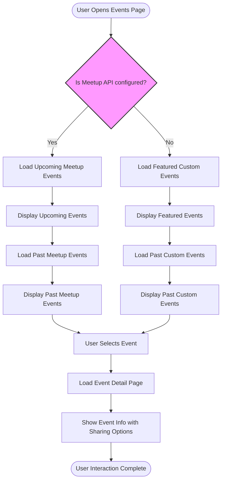

# Managing Events: From Creation to Promotion

## Overview
This guide walks you through managing your community events within Aura — from creating and updating custom and recurring events to strategically promoting them through the platform. You'll learn how events are presented across various parts of the app, including the home page features, the comprehensive events list, and dedicated event detail pages. Additionally, best practices are shared to help you engage your audience effectively.

---

## 1. Workflow Overview

### Task Description
Manage the full lifecycle of your community events: create or update events, publish them as custom or recurring entries, and ensure they surface correctly in Aura’s various event displays and detail views.

### Prerequisites
- Access to Aura Admin or your backend to create and update event data.
- Familiarity with event parameters such as name, date, venue, visibility, and feature status.
- Meetup API key configured (optional) if leveraging Meetup events.

### Expected Outcome
- Your events will be organized and displayed in the app’s Home Page feature sections, Events list, and detailed event views.
- Users will be able to discover, explore, and share event information easily and reliably.

### Time Estimate
About 15-30 minutes to understand and apply event creation and promotion practices effectively.

### Difficulty Level
Beginner to Intermediate

---

## 2. Managing Events: Step-by-Step

### 2.1 Creating or Updating Custom Events

1. **Access Your Event Management Interface**
   - Typically done through Aura Admin or your event management backend.

2. **Define Event Details Clearly:**
   - Include the event name, date, venue details, description, and visibility settings.
   - Mark the event as visible (`visible: true`) to allow it to appear in the public application.

3. **Save the Event Record:**
   - Ensure your changes are saved to Firestore or your backing data store.

4. **Validation:**
   - Confirm that the event appears in the Custom Past Events or Upcoming Events section by checking through the Aura main app or admin preview.

<Note>
Visibility status is critical: events where `visible` is false will not show in the application.
</Note>

### 2.2 Surfacing Events:

- **Home Page Feature Events**: Events marked as featured are displayed prominently on the home page in the `FeaturesEvents.vue` component.
- **Event Listings:**
  - Upcoming events are featured based on Meetup API data or custom events.
  - Past events are listed in reverse chronological order, presented via `PastEvents.vue` (Meetup sourced) or `CustomPastEvents.vue` (custom events) depending on your setup.

### 2.3 Understanding Event Display Components

- **Upcoming Events (`UpcomingEvents.vue`):** Fetches upcoming events, typically from Meetup if configured, showing loading states and handling no-results gracefully.

- **Past Events (`PastEvents.vue` and `CustomPastEvents.vue`):** Displays past events searchable via filters and pagination.

- **Featured Events (`FeaturesEvents.vue`):** Highlights select event IDs set as featured; fetches and displays relevant details.

### 2.4 Using Event Detail Views

- Navigate to individual event pages via `/events/:id` to see detailed information including schedules, speakers, partners, and sharing options.
- The main view (`Events/MainView.vue`) handles data loading, visibility checks, and sharing features.

### 2.5 Sharing and Promoting Events

- The event page includes a sharing button allowing users to share via browser-native share dialogs.
- Use event detail URLs to promote on social channels and newsletters.

---

## 3. Practical Examples

### 3.1 Viewing Past Custom Events

```vue
<!-- Sample usage snippet from CustomPastEvents.vue component -->
<v-data-table
  :items="eventsData"
  :headers="headers"
  :search="search"
  :items-per-page="5"
  :loading="isLoading"
>
  <template v-slot:item.action="{ item }">
    <a :href="`/events/${item.id}`" target="_blank">See More</a>
  </template>
</v-data-table>
```

### 3.2 Feature Events Display Logic

```javascript
// Fetch featured event IDs, then map to custom event data
service.getFeaturesEvents().then(res => {
  if(res.success){
    this.FeaturesEventID = res.data;
    this.getAllCustomEvents();
  }
});

service.getAllCustomEvents().then(res => {
  if(res.success){
    this.featureEvendsData = this.AllCustomEvents.filter(ev =>
      this.FeaturesEventID.includes(ev.id)
    );
  }
});
```

### 3.3 Event Detail Loading

```javascript
service.getEvent(this.$route.params.id).then(res => {
  if(res.success && res.data.visible){
    this.EventData = res.data;
  } else {
    this.$router.push({ path: '/events' });
  }
}).catch(e => {
  console.error(e);
});
```

---

## 4. Troubleshooting and Tips

### Common Issues

- **Events Not Showing:** Verify the `visible` flag on your event documents.
- **No Upcoming Events Displayed:** Confirm your Meetup API key is set up correctly and the community has scheduled upcoming events.
- **Loading Indicators Persist:** Check network connectivity and Firestore permissions.
- **Sharing Not Working:** Ensure browser supports the Web Share API; otherwise, fallback options are necessary.

### Best Practices

- Maintain consistent and comprehensive event data, including start/end dates and venues.
- Leverage the featured event system for highlighting critical community meetups or flagship events.
- Regularly update and archive past events to keep listings relevant.
- Include rich descriptions and social media links in event details to improve engagement.

### Performance Considerations

- Use pagination or limit queries to avoid overwhelming users with too many events.
- Cache event data locally where possible to enhance load times and offline access.

### Alternative Approaches

- For communities not using Meetup, curate events fully through custom events in the backend.
- Consider integrating other third-party event sources by extending current services.

---

## 5. Next Steps & Related Guides

- Visit **Showcasing Teams and Speaker Profiles** to learn how to highlight your community speakers alongside events.
- Explore **Integrating Blogs and Media** for content marketing tied to your events.
- Review **Theme Switching & Offline Operation (PWA)** to enhance user experience around event browsing.
- For admins: consult the Aura Admin documentation on **Publishing and Managing Events** to control events effectively.


---

## Appendix: Aura Events Workflow Diagram


---

# End of Guide

For further assistance or to provide feedback, please refer to the Aura community documentation hub.