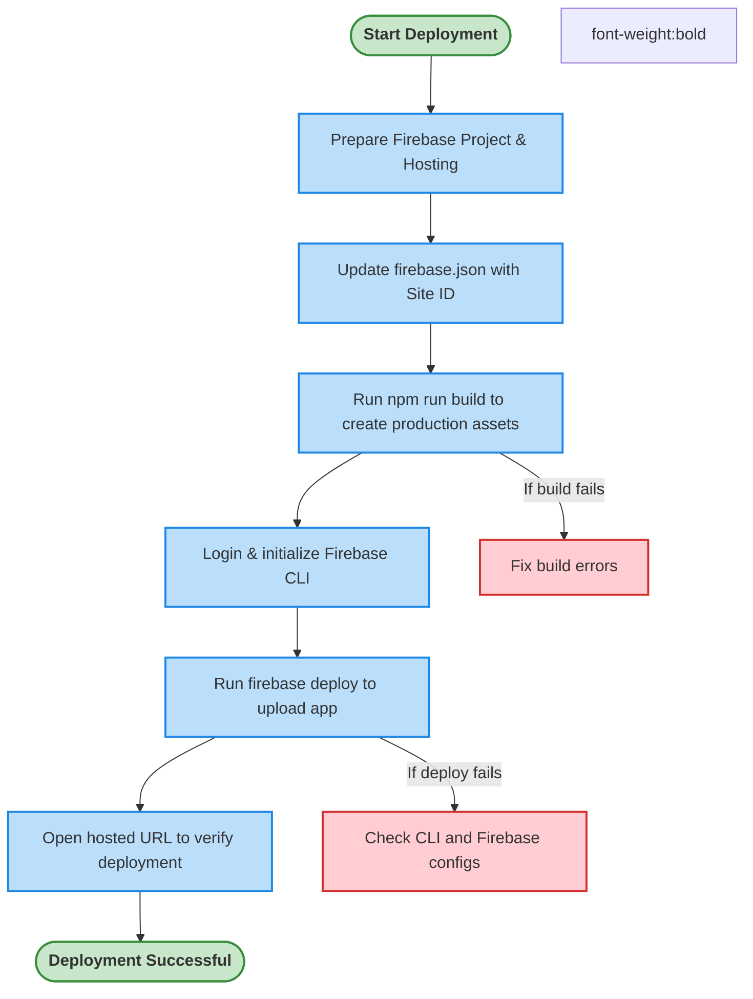

# Deploying Your Community App on Firebase

Deploy your Aura-powered tech community web app to Firebase Hosting with ease by following these precise instructions. This guide walks you through the necessary environment preparation, updating essential configuration files including your Firebase Hosting site ID, building the production app, and deploying it, ensuring your community app is live and performant.

---

## 1. Deployment Workflow Overview

### Task Description
Deploy the Aura web application successfully to Firebase Hosting to make your community app publicly available on a custom Firebase-backed URL.

### Prerequisites
- Completed Aura app setup locally with Firebase configured.
- Firebase project created with Hosting enabled.
- Firebase CLI installed globally (`npm i -g firebase-tools`).
- Firebase project ID and site ID obtained.
- Production build of Aura generated.

### Expected Outcome
Your Aura app is live and accessible via your configured Firebase Hosting URL with optimized assets.

### Time Estimate
Approximately 20-30 minutes.

### Difficulty Level
Intermediate — familiarity with CLI, Firebase console, and project configuration required.

---

## 2. Step-by-Step Deployment Instructions

### Step 1: Prepare Your Firebase Project for Hosting

1. Sign in to the [Firebase Console](https://console.firebase.google.com/).
2. Select your existing Aura project or create a new project.
3. Navigate to Hosting from the sidebar and click **Get Started**.
4. Confirm your site domain (usually `<project-id>.web.app`). Note your **Site ID** (prefix of your hosting URL).

### Step 2: Update Your `firebase.json` File with Site ID

1. Open your local Aura project directory.
2. Open the `firebase.json` file located at the project root.
3. Modify the `site` property under `hosting` to match your Firebase Hosting Site ID.

```json
{
  "hosting": {
    "site": "Your_Firebase_Hosting_id",
    "public": "dist",
    "rewrites": [{
        "source": "**",
        "destination": "/index.html"
    }],
    "ignore": [
      "firebase.json",
      "**/.*",
      "**/node_modules/**"
    ]
  }
}
```

> Replace `Your_Firebase_Hosting_id` with the exact Site ID from your Firebase project.

### Step 3: Generate the Production Build of Aura

In your project root, run:

```bash
npm run build
```

- This creates an optimized production-ready version of your app inside the `dist/` directory.
- Confirm the `dist/` folder contains your static files.

### Step 4: Log in and Initialize Firebase CLI (if not already done)

If you haven't logged in or set up Firebase CLI for the project:

```bash
firebase login
firebase use --add
```
- Choose your Firebase project from the options.

### Step 5: Deploy to Firebase Hosting

Run:

```bash
firebase deploy
```

- This uploads your app from the `dist/` directory to Firebase Hosting.
- Monitor the CLI output for success confirmation.

### Step 6: Verify the Deployment

1. After deployment completes, you will receive URLs in the CLI output.
2. Open the provided hosting URL in your browser.
3. Confirm your Aura app loads correctly and is fully functional.

---

## 3. Practical Tips and Best Practices

- **Consistent Firebase Project**: Use the *same* Firebase project and site ID as configured in your Aura Admin dashboard.
- **Test Before Deploying**: Always run `npm run build` locally and serve via static server (e.g. `npx serve dist`) to validate.
- **Service Worker Updates**: Your app uses a service worker for offline support. When you deploy updated versions, users might see the "New version available" prompt — allow them to refresh.
- **Firebase Rules and Security**: Ensure your Firestore and Storage security rules are correctly configured to prevent unauthorized access.

---

## 4. Troubleshooting Common Deployment Issues

<AccordionGroup title="Deployment Issues & Solutions">
<Accordion title="Incorrect Site ID in firebase.json">
Make sure the `site` value in `firebase.json` matches exactly your Firebase Hosting site ID. Any mismatch leads to failed deployments or unexpected URLs.
</Accordion>
<Accordion title="Build Directory Does Not Exist or Is Empty">
Confirm you've run `npm run build` successfully and the `dist/` directory contains compiled static files before deploying.
</Accordion>
<Accordion title="Firebase CLI Login Issues">
If `firebase deploy` fails due to authentication errors, re-run `firebase login` and follow the login prompts.
</Accordion>
<Accordion title="App Does Not Load Properly After Deployment">
Check browser console for errors, particularly service worker issues. Try clearing cache or opening in incognito mode. Confirm all static assets are properly copied.
</Accordion>
<Accordion title="Service Worker Update Not Prompting">
Ensure your app's `registerServiceWorker.js` is correctly set up to listen for updates and notify users to refresh.
</Accordion>
</AccordionGroup>

---

## 5. Next Steps & Related Resources

### What’s Next?
- Configure advanced Firebase security rules for Firestore and Storage.
- Integrate Aura Admin for seamless content management.
- Customize your app theme and branding for community identity.
- Enable SEO optimization and monitor app performance.

### Related Documentation
- [Configuring Firebase Integration](../install-configure/firebase-setup)
- [Building & Deploying Aura](../run-validate-deploy/firebase-deployment)
- [Optimizing PWA and Offline Support](../../guides/advanced-customization-and-optimization/optimizing-pwa-and-offline-support)
- [Troubleshooting Common Setup Issues](../run-validate-deploy/setup-troubleshooting)

---

## 6. Deployment Flow Diagram



---

### Summary
By carefully updating your Firebase project configurations and building the Aura app for production, you can deploy your community web app seamlessly to Firebase Hosting. This guide empowers you to prepare your environment, run the optimized build process, perform the deployment, verify success, and troubleshoot effectively.


---