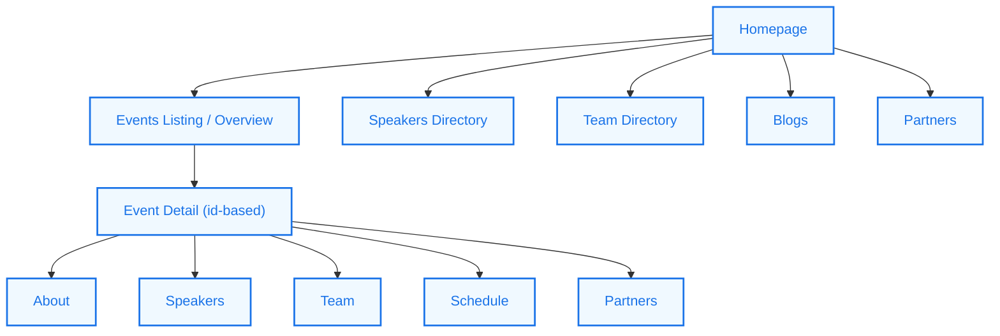

# Understanding Aura’s Structure & Page Navigation

Get a guided tour of Aura’s core user-facing pages, navigation patterns, and content presentation strategies to understand how the platform surfaces information seamlessly across the community site.

---

## 1. Introduction
Aura is designed as a fast, mobile-first web app that empowers tech communities to showcase their events, teams, speakers, and related content. This guide walks you through the main UI sections, explains the navigation routes, and illustrates how content is loaded and managed to help you get a clear picture of Aura’s user experience flow.

---

## 2. Aura’s User-Facing Structure
The main user-facing pages include:

- **Homepage**: A dynamic landing page introducing the community and highlighting upcoming and featured events.
- **Events Listing & Details**: Pages for exploring upcoming events, past events, and detailed event views.
- **Speakers Directory**: Profiles showcasing speakers involved in events.
- **Team Directory**: Details about the community’s organizing team.
- **Blogs & Partners**: Additional content sections supporting community engagement.

Each section follows a clear navigation pattern supported by Vue Router, enabling a consistent and responsive experience.

### 2.1 Homepage
The homepage (`src/views/Home.vue`) is a composition of several smaller components, including:

- **HomeStartScreen**: Welcomes users with essential branding and messaging.
- **WhatWeDo**: Explains the community’s mission and activities.
- **AboutCommunity**: Shares background information about the community.
- **Events (Preview)**: Highlights a summary view of upcoming and featured events.
- **Partners**: Lists community partners supporting the ecosystem.

This modular approach allows smooth conditional rendering based on configuration and available data, including dark mode support for visual consistency.

### 2.2 Events Pages
Aura organizes event-related content into multiple components and views:

- **Events Summary on Home** (component `src/components/home/Events.vue`):
  - Shows a preview of up to four past meetups with loading skeletons as placeholders.
  - Handles loading states, error notifications, and no-results messages gracefully.
  - Provides a 'See More' link navigating to the full events listing.

- **Full Events Directory** (`src/components/events/CustomPastEvents.vue` and `src/components/events/PastEvents.vue`):
  - Lists past events in reverse chronological order with search filtering and pagination.
  - Displays key details like event name, date, venue, and actionable links for more information.
  - Provides user-friendly feedback on errors or when no events match the search.

- **Upcoming Events** (`src/components/events/UpcomingEvents.vue`):
  - Displays upcoming events fetched via Meetup API.
  - Includes loaders and no-event notifications to keep users informed.

- **Detailed Event View** (`src/views/Events/MainView.vue`):
  - When a user selects an event, Aura loads a dedicated detailed view with event-specific navigation.
  - Side drawer navigation (`src/components/CutomEvent/EventDrawer.vue`) lets users explore event-specific pages: About, Speakers, Team, Schedule, Partners.
  - Includes mobile-friendly share functionality to promote events within the community.

### 2.3 Speakers and Team
- The **Speakers** directory is accessible via main navigation and within custom event contexts.
- The **Team Directory** functions similarly, providing detailed member views.
- These pages integrate tightly with the event views and are linked through the event drawer for contextual association.

### 2.4 Blogs, Partners, and Contact
Aura features dedicated pages for partners and blogs visible via main navigation. These pages offer community news, external alliances, and direct contact channels.

---

## 3. Navigation & Routing
Aura uses Vue Router to manage navigation with clear URL schemas for each page type.

- Base event listing: `/events`
- Detail view for a specific event: `/events/:id` with nested child routes such as `/events/:id/about`, `/events/:id/speakers`, `/events/:id/team`, etc.
- Navigation drawer components dynamically build links scoped to the current event ID.

The router also manages page titles dynamically for SEO and accessibility.

#### Example Route Configuration Snippet
```javascript
{
  path: '/events/:id',
  name: 'CustomEvent',
  component: MainView,
  children: [
    { path: 'about', name: 'CustomEventHome', component: About, meta: { isEvent: true } },
    { path: 'speakers', name: 'CustomEventSpeaker', component: Speaker, meta: { isEvent: true } },
    // More child routes
    { path: '', redirect: 'about', meta: { isEvent: true } }
  ]
}
```

This structure provides intuitive and scalable navigation for multi-part event experiences.

---

## 4. Data Loading Patterns & User Experience
Aura fetches event and related data through dedicated services, interfacing primarily with Meetup and backend APIs.

- Loading states (spinners, skeleton loaders) keep users informed during data fetch.
- Conditional rendering displays errors or no-data messages to avoid dead ends.
- Search inputs with live filtering empower users to find specific events or team members efficiently.

### 4.1 Examples of UI Feedback
- If no events are found, dedicated messages inform users clearly.
- Snackbar notifications present transient error alerts.
- Dark mode themes apply consistent colors and visual cues across components.

---

## 5. Practical Tips & Best Practices
- **Explore Events Hierarchically:** Users should start from the overview pages and drill down via the event drawer navigation for rich details.
- **Use Search to Filter Large Lists:** When handling many past events, search input helps narrow down results instantly.
- **Notice Loading Indicators:** Aura adapts dynamically to data readiness; patience during network requests is rewarded with fully rendered content.
- **Sharing Event Details:** Utilize the mobile-friendly share button on event detail pages to boost community awareness.

---

## 6. Common Pitfalls and Troubleshooting

<AccordionGroup title="Troubleshooting Navigation and Content Loading">
<Accordion title="Events Not Displaying or Loading">
- Ensure Meetup API keys are correctly configured in the application settings.
- Check for network issues that may block API calls.
- Verify that event visibility flags are set properly to appear in listings.
</Accordion>
<Accordion title="Navigation Redirects to Homepage Unexpectedly">
- Confirm that event data is marked as 'visible'; hidden events redirect to the main Events page.
- Ensure Vue Router meta tags and paths align with expected routes.
</Accordion>
<Accordion title="Error Alerts Appear Frequently">
- Check service availability for meetup and backend APIs.
- Validate proper state mutations and error handling in Vuex store sequences.
</Accordion>
</AccordionGroup>

---

## 7. Next Steps & Related Content

- Dive deeper into **Publishing and Managing Events** to understand content creation and administration.
- Explore **Showcasing Team Members & Speakers** for strategies on enriching community profiles.
- Learn about **Optimizing PWA and Offline Experience** to improve Aura’s mobile reliability.

Refer to these guides in the documentation for structured workflows and detailed technical guidance:

- [Publishing and Managing Events](/guides/managing-content-events-team/publishing-and-managing-events)
- [Showcasing Team and Speakers](/guides/managing-content-events-team/showcasing-team-and-speakers)
- [Deploying Aura to Firebase: A Step-by-Step Guide](/guides/getting-started-workflows/deploying-aura-to-firebase)

Additionally, the [What is Aura?](/overview/intro-value/product-overview) page provides a foundational understanding of the product's purpose and value.

---

## 8. Visual Overview: Navigation Flow


---

By following this guide, you will gain a solid understanding of how Aura structures its content and navigation flow to deliver a cohesive and user-friendly community platform.

---


