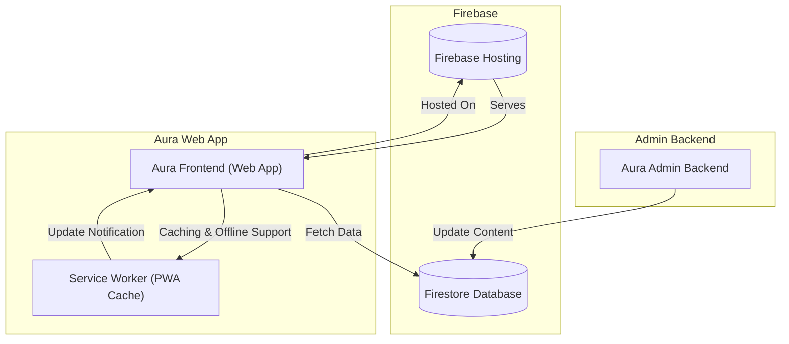

# Integration with Admin & External Systems

Aura is crafted to work seamlessly with the Aura Admin backend and external systems, creating a unified ecosystem for managing your community’s digital presence efficiently. This page guides you through how Aura integrates with Admin and Firebase to streamline content, team, and event management, facilitating easy deployment and ongoing updates.

---

## Why Integration Matters

Bridging Aura’s frontend experience with powerful backend management tools turns the platform into a true community management hub. Rather than siloed workflows, you gain:

- **Smooth content synchronization**: Updates pushed from Aura Admin backend reflect instantly on your public site.
- **Centralized data management**: Teams, events, speakers, and partners curated through Admin are automatically surfaced in the Aura web app.
- **Effortless deployment**: Built with Firebase Hosting, changes deploy rapidly without complicated steps.

This integration model frees community organizers to focus on engagement rather than technical overhead.

---

## How Aura Connects with Aura Admin & Firebase

Aura’s architecture revolves around Firebase as the central datastore and hosting platform, enabling real-time data flows between Admin and the public-facing web app:

- **Firebase Firestore**: All community data (teams, events, speakers, partners, configurations) is stored here, managed primarily through Aura Admin.
- **Firestore Collections**: Dedicated collections such as `team`, `events`, `Speakers`, `partners`, and `config` house distinct data domains.
- **Aura Admin** provides a user-friendly interface for community managers to create, update, and delete content within these collections.
- **Aura Web App** consumes this data via Firebase SDK and RESTful calls to update the UI dynamically.
- **Firebase Hosting** serves Aura with high availability and integrated PWA support for offline accessibility.

Together, these components create a plug-and-play setup, minimizing manual sync tasks and lowering technical barriers.

---

## Typical User Workflow

1. **Manage Content in Aura Admin**
   - Community managers add or edit events, team members, speakers, or partners.
   - Configuration updates and branding settings are updated to align with your community’s identity.

2. **Data Storage in Firebase**
   - Changes are immediately saved in Firestore collections, the single source of truth.

3. **Aura Web App Fetches and Displays Updates**
   - Upon users visiting the site or the app refreshing, the latest data from Firestore is fetched automatically.
   - UI components like Events list, Speaker profiles, and Team showcase update seamlessly based on this data.

4. **Deployment & Cache Refresh**
   - The app is deployed on Firebase Hosting with service worker integration for offline support.
   - When new versions are available, users see in-app notifications prompting them to refresh for the latest content.

This cycle ensures community sites remain fresh without manual rebuilds or redeployments by non-technical managers.

---

## Key Features of the Integration

- **Real-time content updates**
  - Admin changes propagate to the public app without delay.

- **Modular Firebase data collections**
  - Isolated datasets for events, teams, speakers, and partners enable targeted querying and management.

- **Robust service layer (`appservices`)**
  - Encapsulates interaction with Firebase Firestore and external APIs like Meetup and Medium blogs,
  - Simplifies data fetching into promises returning success and data payloads.

- **Offline and PWA support**
  - Via Firebase Hosting and service worker registration, ensuring seamless user experience even with intermittent connectivity.

- **Error feedback and recovery**
  - Snackbar notifications and error alerts guide users and admins if integration points fail unexpectedly.

---

## Practical Examples

- **Syncing Events from Aura Admin to Public Site**
  - When a new Meetup event is added in Admin, it appears under the "Upcoming Events" component, powered by `getAllUpcomingMeetupsEvents` fetching from Meetup APIs.

- **Team Management**
  - Adding or modifying a team member in Admin stores data in Firestore's `team` collection,
  - Aura fetches the up-to-date list via the `getTeam` service, displaying member details across the site.

- **Blog Integration**
  - Medium blog RSS feeds are pulled using the `getAllMediumBlogs` service, enabling a dynamic blog section without manual content management.

---

## Common Pitfalls & Troubleshooting

<Tip>
Check the Firebase configuration in both Aura and Aura Admin to ensure they point to the same project. Misaligned projects cause synchronization failures.
</Tip>

<Warning>
Network connectivity issues may prevent live fetching from Firebase or external APIs like Meetup. Use the offline support features wisely but verify service availability.
</Warning>

<Note>
If you see stale data or the UI prompts for refresh repeatedly, ensure the service worker in your app is properly configured and updates are applied per the [Optimizing PWA and Offline Support](../guides/advanced-customization-and-optimization/optimizing-pwa-and-offline-support) guide.
</Note>

For detailed troubleshooting of setup and deployment, refer to the [Troubleshooting Setup & Common Issues](../getting-started/run-validate-deploy/setup-troubleshooting) and [Troubleshooting Deployment](../../deployment/operations-monitoring-maintenance/troubleshooting-deployment) documents.

---

## Visualizing the Integration Flow

---

## Getting Started with Integration

To enable this integration quickly:

1. **Set up and configure Aura Admin**
   - Follow the initial Admin setup guides to connect it with your Firebase project.

2. **Configure Firebase credentials in Aura Main**
   - Ensure the Firebase config points to the same project as Admin.

3. **Launch Aura Admin and create your initial content**

4. **Start the Aura Web App locally or on Firebase Hosting**
   - Verify content flows correctly from Admin → Firestore → Web App.

5. **Deploy and enable service worker for offline experience**

For detailed instructions, consult the [Connecting Aura Admin for Community Management](../../guides-tab/getting-started/connecting-aura-admin) and [Deploying Your Community App on Firebase](../../guides-tab/getting-started/deploying-on-firebase) guides.

---

## Summary

This page positions the Aura web application as a data consumer that thrives by integrating closely with Aura Admin backend and Firebase infrastructure. By centralizing content management, enabling real-time data syncing, and deploying on Firebase Hosting with progressive web app support, Aura ensures community managers deliver a captivating, reliable digital presence effortlessly.

For a smooth integration experience, start by verifying your Firebase setup and content lifecycle between Admin and Aura, then leverage the rich tooling and PWA capabilities to enhance user engagement and maintainability.

---

## Related Documentation

- [What is Aura?](../product-intro-core-concepts/what-is-aura)
- [Feature Overview](../architecture-features-users/feature-glance)
- [Connecting Aura Admin for Community Management](../../guides-tab/getting-started/connecting-aura-admin)
- [Deploying Your Community App on Firebase](../../guides-tab/getting-started/deploying-on-firebase)
- [Troubleshooting Setup & Common Issues](../../getting-started/run-validate-deploy/setup-troubleshooting)
- [Optimizing PWA and Offline Support](../../guides/advanced-customization-and-optimization/optimizing-pwa-and-offline-support)

---

## Additional Resources

- [Aura GitHub Repository](https://github.com/gdg-x/aura)
- [Aura Admin GitHub Repository](https://github.com/gdg-x/aura-admin)
- [Firebase Documentation](https://firebase.google.com/docs)

---