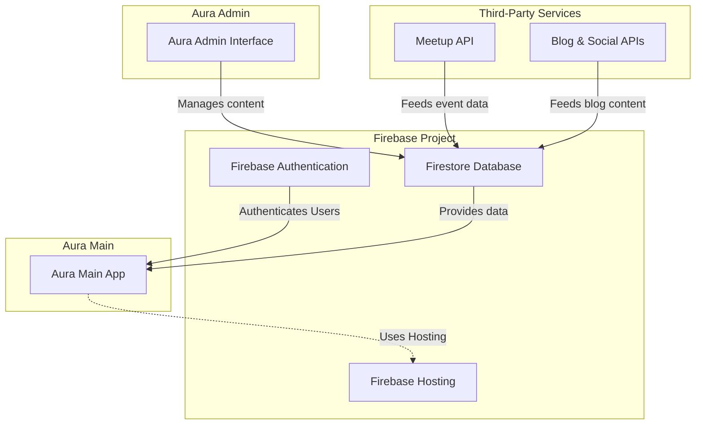

# Integrations & Dependencies

Unlock the full potential of Aura by understanding how it seamlessly connects with external systems such as Firebase, Aura Admin, and third-party content sources. This page provides a clear roadmap of integration touchpoints, necessary prerequisites, and how authentication and data flow from setup to daily operation. Whether you are configuring for the first time or troubleshooting network connections, this guide ensures you can navigate Aura’s ecosystem with confidence.

---

## Why Integrations Matter

Aura is more than just a web app; it is a dynamic platform designed specifically to manage tech communities by connecting various systems that power content, security, and user experience. Integrations enable Aura to:

- Pull event information dynamically from Meetup.
- Synchronize content administration through Aura Admin.
- Authenticate users securely using Firebase.
- Aggregate third-party content sources such as blogs and social feeds.

These integrations ensure your community data stays consistent, up-to-date, and secure without duplicating effort.

---

## Core Integration Points

### 1. Firebase

**Role:** Central backend platform providing database, authentication, and hosting.

- Aurawas built on Firebase’s cloud infrastructure.
- User authentication (Firebase Authentication) enables secure login and access control.
- Firestore database stores event details, team member profiles, blog posts, and configuration data.
- Hosting manages Aura’s Progressive Web App (PWA) delivery with offline support.

**User Benefit:** Simple setup and managed backend means you don’t need to manage servers or complex infrastructure. Firebase ensures data is synced in real time across your community.

### 2. Aura Admin

**Role:** Dedicated administrative interface to manage community assets.

- Sets up and edits events, speakers, teams, and blog posts.
- Shares the same Firebase project to ensure data consistency between Admin and Aura Main.

**User Benefit:** You can manage all your community’s data through an easy-to-use interface without touching code or database directly.

### 3. Third-Party Content Sources

**Role:** External APIs like Meetup for events, Medium or custom blog platforms for content.

- Meetup API integration automatically pulls upcoming and past event data when Meetup is configured.
- Blogs and community updates may be integrated via third-party RSS or social APIs.

**User Benefit:** Automatic content updates reduce manual work and keep community pages fresh and relevant.

---

## Integration Flow: Setup to Operation

1. **Firebase Project Alignment:**
   - Use a single Firebase project for both Aura Main and Aura Admin.
   - Configure Firebase SDK details (apiKey, authDomain, projectId, etc.) in Aura’s `src/config/firebase.js`.

2. **Deploy Aura Admin:**
   - Set up the Aura Admin interface first (see prerequisite guides).
   - Populate or manage your community data (events, team, blog).

3. **Configure Meetup and Third-Party APIs:**
   - Add your Meetup API keys and links in the configuration (`keysandsecurity`) so Aura can fetch event data.

4. **Authentication and Data Sync:**
   - Firebase Authentication secures user access.
   - Aura Main reads from Firestore updated by Aura Admin and Meetup integration.

5. **Run Aura Main:**
   - The Aura Main app fetches and displays this data dynamically.
   - Offline support via PWA ensures user experience persistence.

---

## Practical Setup Tips & Best Practices

- Always create and configure the same Firebase project for Aura Admin and Aura Main to ensure seamless data sharing.
- Make sure your Firebase project config in `firebase.js` is complete and accurate to avoid connectivity issues.
- Before going live, test Meetup API integration to confirm events load correctly.
- Use environment variables or secure config storage for API keys in production.
- Deploy Firebase hosting with correct rewrites to serve the PWA correctly.

---

## Common Pitfalls & Troubleshooting

<AccordionGroup title="Common Integration Issues and Fixes">
<Accordion title="Misaligned Firebase Projects">
Using different Firebase projects between Aura Admin and Aura Main causes sync failures. Double-check your Firebase project IDs and update configs accordingly.
</Accordion>
<Accordion title="Incorrect Firebase Configuration">
Incorrect or incomplete Firebase SDK config in `firebase.js` prevents app initialization. Verify values carefully against Firebase Console.
</Accordion>
<Accordion title="Meetup API Not Fetching Events">
Ensure the correct Meetup API key and group URLs are set in the config. Check your network logs for failed requests or rate limits.
</Accordion>
<Accordion title="Authentication Failures">
Confirm that Firebase Authentication is enabled and configured properly. Test sign-in flows during development.
</Accordion>
</AccordionGroup>

---

## Visualizing Integration Architecture

---

## Next Steps

To move forward with setting up and optimizing your integrations:

- **Set up Aura Admin first**: Refer to the [Aura Admin Notice](getting-started/setup-prerequisites/aura-admin-notice) to get started.
- **Configure Firebase properly**: Follow the [Configuring Firebase](getting-started/configuration-run/firebase-setup) guide to ensure connectivity.
- **Deploy locally and validate**: Use [Running Aura Locally](getting-started/configuration-run/local-run) and [Validating Your Setup](getting-started/troubleshooting-validation/first-validation) to verify.
- **Refer to Architecture Overview**: For a deeper understanding, visit [Architecture Overview](overview/architecture-system/system-architecture).

This foundational knowledge streamlines your Aura deployment and empowers you to leverage integrations fully.

---