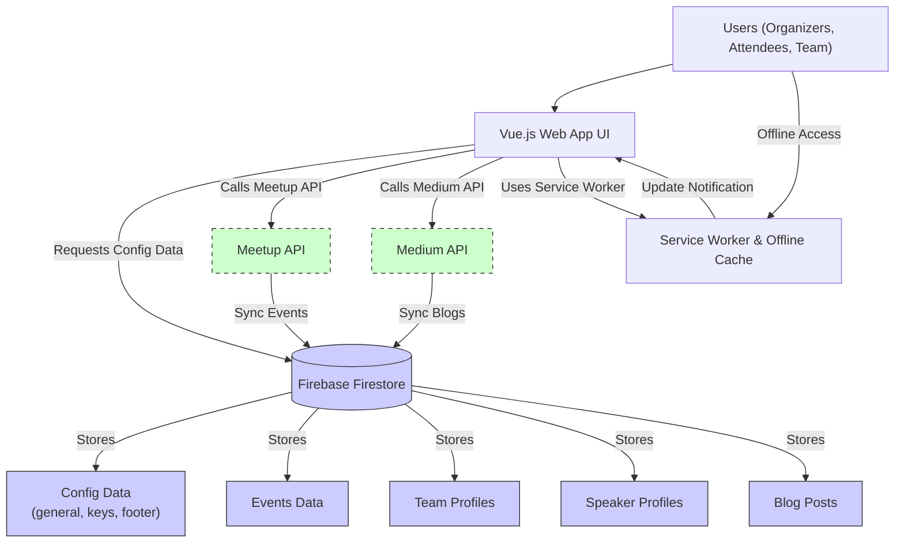

# Architecture Overview

## Unlocking Aura's Inner Workings: How the System Interacts to Empower Your Community

Aura is a Progressive Web App crafted to unify and streamline the management of technology-focused communities like GDGs and DSCs. This page offers a high-level architectural view, complete with an illustrative Mermaid.js diagram, to reveal how Aura’s core modules, backend services, and external integrations harmonize to deliver a fluid, robust user experience.

---

### Understanding Aura’s Architecture at a Glance

At its core, Aura is a modular system where the **Vue.js-based Web App UI** delivers dynamic interfaces to end users, while **Firebase Backend Services** handle data storage, authentication, and real-time synchronization. External integrations such as Meetup and Medium enrich Aura’s ecosystem by importing events and blog content, respectively, maintaining updated community engagement.

This architecture ensures that users—from organizers to attendees—interact seamlessly with up-to-date data, whether online or offline, on any device.

---

### Key Modules & Data Flow Explained

- **Web App UI (Vue.js)**
  - Serves as the interactive front layer, rendering community info, events, speakers, team profiles, and blogs.
  - Manages navigation and state through Vue Router and Vuex respectively.
  - Implements service workers for offline support and PWA functionalities.

- **Firebase Backend Services**
  - Provides real-time database updates via Firestore.
  - Handles authentication and security.
  - Stores configuration data including general settings, keys, and footer links.

- **External Integrations**
  - **Meetup API:** Automatically pulls upcoming events into Aura, enhancing event visibility.
  - **Medium API:** Feeds blog posts for community storytelling and updates.

- **Service Worker & Offline Cache**
  - Monitors app versioning and pushes updates to users.
  - Enables content availability and offline usability.

This modular approach enables each part of Aura to specialize while collaborating efficiently, providing users with a fast, consistent, and reliable experience regardless of connectivity.

---

### How Data Flows Through Aura

1. **User Interaction:** The user accesses Aura via the Vue.js web interface.
2. **Configuration Loading:** On app launch, Vuex state fetches configuration data from Firebase to initialize the app’s settings.
3. **Content Rendering:** Depending on navigation, Vue Router loads respective views (Events, Team, Speakers, Blogs), which query Firebase and external APIs as needed.
4. **External Data Sync:** Scheduled or on-demand calls to Meetup and Medium APIs update event and blog listings.
5. **Offline Preparedness:** Service workers cache key assets and data sets to allow uninterrupted access even when offline.
6. **Update Management:** On detecting new app versions, the service worker triggers user prompts to refresh, ensuring they always have the latest features.

---

### Architecture Diagram

---

### Why This Architecture Matters To You

By clearly separating presentation, data management, and external content ingestion, Aura ensures:

- **Reliability:** Firebase’s real-time database and service worker caching provide uninterrupted access even with unreliable connectivity.
- **Scalability:** Modular design keeps the app responsive as community data grows.
- **Extensibility:** Easily integrates additional APIs or community content sources.
- **Maintainability:** Clean separation of concerns simplifies updates, bug fixes, and feature expansion.

---

### Practical Tips for Working with Aura’s Architecture

- **Leverage Offline Support:** Encourage users to interact with Aura where internet is spotty; offline data sync ensures they still see critical info.
- **Monitor Configuration Updates:** Understand the central role of Firebase config data in powering the UI — incorrect config can cause display issues.
- **Stay Updated:** When you see a refresh notification from the service worker, update promptly to access the latest improvements.
- **Understand Navigation Routes:** The Vue Router manages page transitions including event-specific nested views (about, speakers, schedule) — recognizing these paths can help you customize or troubleshoot UI flows.

---

### Getting Deeper

For hands-on setup or troubleshooting related to this architecture, explore:

- [Getting Started: Setup Prerequisites](https://your-doc-home/getting-started/setup-prerequisites/aura-admin-notice)
- [Running Locally & Validation](https://your-doc-home/getting-started/installation-and-configuration/local-run-validation)
- [Production Build & Deployment](https://your-doc-home/getting-started/deployment-quickstart/production-build)
- [Integration Details](https://your-doc-home/overview/architecture-system/integration-overview)

---

Harness Aura’s architecture knowledge to streamline customization, diagnose issues effectively, and maximize your community’s engagement experience.

---

<Check>
Understanding Aura's architecture empowers you to troubleshoot with confidence, optimize performance, and extend functionality tailored to your community's unique needs.
</Check>

