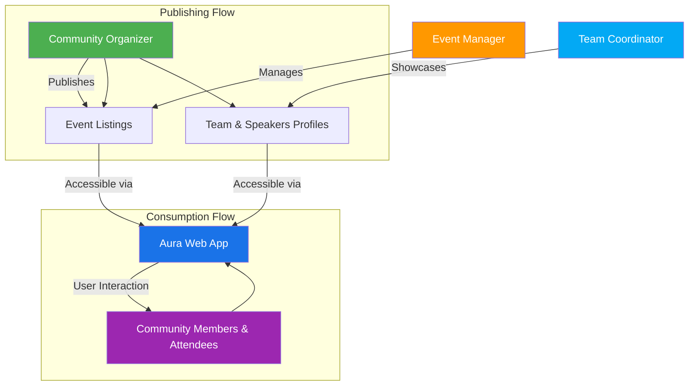

# Who Should Use Aura & Key Use Cases

## Empowering Community Organizers, Event Managers, and Teams

Aura is built for technology communities aiming to streamline their event and member management while promoting visibility and collaboration within and beyond their groups. Whether you're a community organizer planning impactful events, an event manager juggling schedules and speakers, or a team coordinator showcasing your core members, Aura is crafted with your real-world needs in mind.

### Primary Audiences

- **Community Organizers:** Manage your tech community’s presence with ease. Publish events, share team and speaker information, and engage your members through a modern, optimized Progressive Web App.

- **Event Managers:** Simplify the entire event lifecycle — from scheduling sessions to highlighting speakers and promoting events — Aura helps you maintain a dynamic event calendar that stays updated and accessible.

- **Team Coordinators and Core Team Members:** Showcase your community leaders and speakers with dedicated public profiles that support self-branding and community recognition.

## Real Productivity Scenarios with Aura

Aura supports key workflows that transform community and event management from a set of scattered tasks into a unified experience.

### 1. Publishing and Managing Events

Easily create, update, and publish events without needing to build a dedicated website for each new meetup or conference. Aura allows communities to:

- List upcoming and past events with detailed descriptions and media.
- Feature select events prominently to boost visibility.
- Provide attendees with quick access to event information on any device, even offline.

**Example:** A GDG organizer can swiftly publish their monthly meetup details, speakers, agenda, and venue information in Aura — enabling members to discover and RSVP effortlessly.

### 2. Showcasing Team Members & Speakers

Build and present public-facing profiles for your community's core team and speakers. Aura promotes transparency and personal branding by allowing:

- Profiles with biographies, designations, and social links.
- Easy navigation for community members and newcomers to discover team roles and contacts.
- Sharing speaker profiles for event promotion and networking.

**Example:** When preparing a conference, event coordinators can highlight keynote speakers and organizers directly in the app, driving attendee interest and networking opportunities.

### 3. Sharing Speaker Profiles and Self-Branding

Speakers can benefit from Aura’s public shareable URLs, helping them:

- Promote their sessions and personal brand beyond events.
- Link to their profiles from social media or professional sites.
- Foster community trust and engagement through enhanced visibility.

**Example:** A developer sharing their talk about Flutter can use Aura’s speaker profile URL for wider promotion, increasing participation and recognition.

### 4. Seamless Content Discovery & Mobile Accessibility

Aura’s mobile-first design ensures that community members have fast, offline-capable access to all essential event and team content anytime, anywhere.

- No dependence on constant internet connectivity.
- Optimized load times and easy navigation.
- Cross-device and platform accessibility supporting wider reach.

---

## Why Aura Matters to Your Community

### Outcomes You Can Expect

- **Increased efficiency:** Cut down on repetitive tasks like building separate event websites or manually updating team info across platforms.
- **Enhanced community engagement:** Make relevant information instantly accessible and shareable.
- **Stronger branding:** Showcase your community’s expertise and leadership with professional profiles and event promotion.
- **Future-ready:** Benefit from Progressive Web App features like offline support and SEO optimization that expand your community's digital footprint.

### Before Aura vs After Aura

| Without Aura                      | With Aura                                          |
|---------------------------------|---------------------------------------------------|
| Community info scattered in emails, spreadsheets, and social platforms | Centralized, up-to-date information accessible in one app |
| Event promotion requires custom websites or manual updates | Publish events quickly with dynamic pages and shareable URLs |
| Team member visibility limited to offline or external channels | Professional, shareable team and speaker profiles within the community app |
| Dependence on internet connection for accessing information | Mobile-first PWA experience with offline capabilities |

---

## Getting Started Preview

To begin harnessing Aura’s capabilities, simply prepare your environment and connect your Firebase project as described in the setup guides. Key initial steps include:

- Setting up Aura Admin to manage your content effectively.
- Using shared Firebase configuration to unify core data management.
- Creating your first event and publishing team profiles.

For detailed setup, refer to [Prerequisites](/getting-started/preparation/prerequisites) and [Aura Admin Setup](https://github.com/gdg-x/aura-admin) documentation.

---

## Tips & Best Practices

- **Keep your team profiles updated:** Regularly maintain biographies and social links to keep the community informed.
- **Feature your marquee events:** Use the featured event capabilities to draw attention to key happenings.
- **Leverage offline support:** Encourage members to install Aura as a PWA for uninterrupted access.

## Troubleshooting Common Pitfalls

- Ensure that Aura and Aura Admin share the same Firebase project for seamless data integration.
- Verify event dates and details carefully to avoid confusion in listings.
- Check internet connectivity during initial setup to prevent Firebase connection errors.

---

Aura is more than just a tool; it’s a catalyst for thriving, engaged tech communities. By empowering organizers, event managers, and teams with the right workflows and visibility, Aura transforms the way communities connect and grow.

Explore the full potential by diving into related guides and integration overviews.

---

<AccordionGroup title="Related Documentation">
<Accordion title="Overview: What is Aura?">
Learn more about Aura’s core features and value proposition in the [What is Aura?](https://docs.gdg.community/overview/intro-value/product-overview) page.
</Accordion>
<Accordion title="Getting Started: Prerequisites">
Understand the prerequisite setup for Aura and Aura Admin integration in the [Prerequisites](https://docs.gdg.community/getting-started/preparation/prerequisites) guide.
</Accordion>
<Accordion title="Managing Content: Events, Team, and Blogs">
Discover detailed workflows for managing your events and team in the [Publishing and Managing Events](https://docs.gdg.community/guides/managing-content-events-team/publishing-and-managing-events) and [Showcasing Team Members](https://docs.gdg.community/guides/managing-content-events-team/showcasing-team-and-speakers) guides.
</Accordion>
</AccordionGroup>

---

### Visualizing User Roles and Workflows

This flow illustrates how different user roles collaborate through Aura to publish and consume community content.
