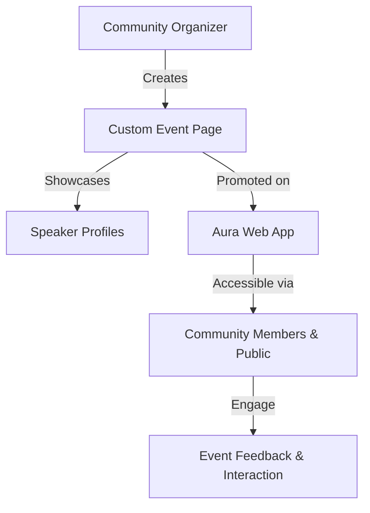

# Product Value & Benefits

Aura delivers a powerful yet simple digital hub designed specifically for tech communities. By offering a fast, SEO-optimized, and easy-to-manage platform, Aura empowers community organizers to promote events, showcase teams, and engage members without the need for deep technical expertise.

## Why Aura Matters to You

Imagine having all your community happenings, speakers, and teams elegantly presented in one place — with minimal effort and maximum impact. Aura transforms fragmented promotion and collaboration into a seamless, accessible experience. It ensures your community’s voice is amplified, easily discoverable, and welcoming for every visitor.

### What You Gain:
- **Effortless Event Promotion**: Create custom event pages that make each meetup or conference stand out, driving attendance and excitement.
- **Public Speaker Directory**: Share profiles and expertise effortlessly, building credibility and personal connection.
- **Team Collaboration Made Simple**: Showcase your organizers and contributors to build trust and accountability.
- **Offline-Ready & Mobile-First**: Your community stays visible and accessible on the go, even with intermittent internet access.
- **SEO Optimized**: Attract more organic visitors by ensuring your content ranks in search engines.

## Core Benefits Explained

### 1. Fast, Lightweight, and Responsive
Aura is optimized for speed to provide a smooth user experience across all devices. Whether community members browse on phones, tablets, or desktops, pages load swiftly, keeping users engaged.

### 2. Easy Content Management
Aura's admin integration (via Aura Admin) means you don’t have to be a developer to maintain your community’s content. Upload speaker bios, event details, and team profiles effortlessly.

### 3. Amplify Your Community Reach
By streamlining event promotion and speaker visibility, Aura helps your community grow and retain members. Visitors find the information they need quickly, boosting participation.

### 4. Offline Accessibility
Built as a Progressive Web App (PWA), Aura works even without a stable internet connection, allowing users to access previous content and navigate essential pages, enhancing reliability.

### 5. Branding and Customization
Tailor your community’s presence by configuring key details like logos, colors, descriptions, and social links, ensuring your digital home feels authentic and welcoming.

## Real-World Scenarios

### Scenario 1: Organizing a Tech Meetup
You plan a monthly tech meetup and want a platform where attendees can easily find the event details, speaker bios, and past events archived. Aura allows you to:
- Publish a custom event page
- Link talks and speakers smoothly
- Drive organic traffic through SEO

### Scenario 2: Building Community Credibility
Your organizers’ and contributors’ profiles matter to new members. Aura’s public speaker directory and team profiles give transparent insight into who is behind your community, building trust and encouraging participation.

### Scenario 3: Handling Connectivity Challenges
Community members joining from remote locations or with limited internet access still need to stay updated. Aura’s offline mode ensures that once pages and content are loaded, they remain accessible.

## What Does Success Look Like?
- Increased event attendance via easy sharing and discoverability
- Higher member engagement with accessible speaker and team info
- Reduced time spent managing and updating community content
- Stronger online presence with improved search ranking

## Getting Started Preview

To begin harnessing Aura’s benefits:
1. **Set up your general community information** using Aura Admin to make your community identifiable and approachable.
2. **Create event pages and populate speaker profiles** that highlight your offerings.
3. **Customize branding elements** like logos and color schemes for a consistent identity.
4. **Deploy Aura and share your new digital hub** confidently with your community.

For detailed steps, see the [Getting Started Guides](getting-started/setup-prerequisites/about-aura) and [Configuring Firebase Integration](getting-started/install-configure/firebase-setup).

---
<Tip>
Unlock the full potential of Aura by consistently updating your event calendar and speaker information. Fresh content drives engagement and grows your community organically.
</Tip>

<Warning>
Ensure that your Firebase configuration is correctly linked with both Aura Main and Aura Admin for smooth content synchronization.
</Warning>

---

## Related Documentation
- [What is Aura?](overview/product-intro-core-concepts/what-is-aura)
- [Core Concepts & Terminology](overview/product-intro-core-concepts/core-concepts)
- [High-Level Architecture](overview/architecture-features-users/high-level-architecture)
- [Managing Events: From Creation to Promotion](guides-tab/community-features/managing-events)

----

### Example: How Aura Streamlines Event Promotion

